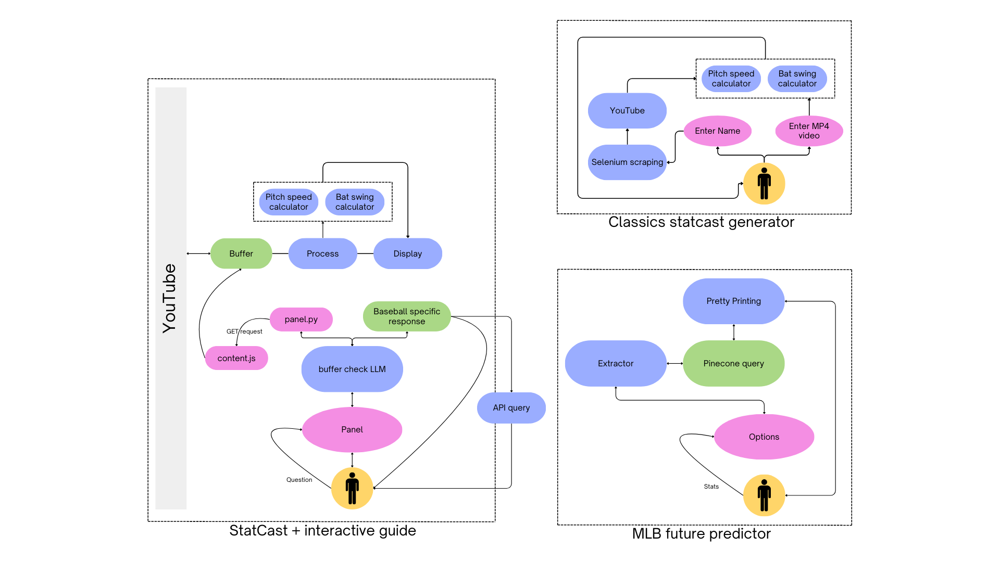

# duxMLB - an extension

  
  

---

Developing an extension that can read your screen and give you live data updates and tips on your favourite baseball games! (With permission). 

> [!IMPORTANT]
> What can you do with duxMLB?

**duxMLB** offers two features
1. Panel page: For when you are watching a YouTube match and want to know about a certain player, or team or the schedule. (can be later extended to others as well)
2. Options page: For predicting your MLB future by comparing you to top players! If you have any legacy game in mind, upload it here for us to analyse and give you the statcast data!

There is also a `guide` page which explains how the site was made and contains all the techincal explanations. Visit this in the `extension options` and figure out what's in store for you!

## What is the panel page?

The panel page contains a `gemini` model that allows you to do the following

- [x] Ask the model about any players, team or MLB schedule and it will give `upto date` information (regards to APIs provided by Google)
- [x] You can, while watching a LIVE match, ask the model statcast data and it will analyize and answer!

> [!NOTE]
> What does that mean?

You can ask it questions like "Yoo! How fast was that pitch?" as soon as the pitcher finished pitching, and we will process the video in the backend, analyse the speed and tell it to you!

`duxMLB` is the most complete MLB guide that exists today.

---

# The workflow

# The looks

This is the side panel. You can open this in any youtube video (currently works only for youtube).

---

This is the options page. This page is to help you predict your MLB future and a how to guide on the **technical implementations** of the extension. It also has functionality to analyse **legacy MLB games** and generate statcast data for that.

---

# Installing

I don't have a CWS developer account (cause I don't have 5 dollars), and hence I couldn't publish this on the webstore. So, I'll give the instructions to run this extension locally on your machine.

1. Clone the repository using

       git clone https://github.com/pUrGe12/MLBxG-extension

2. Now open chrome extensions using

       chrome://extensions

3. Toggle the `developer mode` button (on the top right) and then click on `load unpacked`

   

5. Select the `src` directory (inside the folder you cloned from github).

6. Click on `details` and visit the `options` page. This has more functionalities that cater to the other problems mentioned in the problem statment (and some fun stuff too).
    
   

8. Now you have the extension added.

Now you must create a `.env` file. You don't have to do that yourself, just run the python script and add the relevant values as and when it asks

        python3 createEnvFile.py

Then run the shell script to get selenium installed in your computer (even if you have google chrome, use "N" because you want to make sure it is compatible)

        chmod +x getPreReq.sh
        ./getPreReq.sh

> This is assuming you're on Linux

If not then please head over to [this link](https://googlechromelabs.github.io/chrome-for-testing/) and download the same versions of chrome and chromedriver. (hehe)

Next step is to start the backend. There is just one main file that you need to run. From the root directory of the repo. Run the following commands to install the pre-requisities and run the backend

        pip install -r requirements.txt
        sudo apt install ffmpeg -y
        cd src/backend/ && python3 main.py

You can now start checking it out.

# How to test

1. Testing the panel

- Ask for a player's stats
- Ask for a team's stats
- Ask for the MLB schedule
- Ask for immediate statcast data while watching a live game
- Talk about any other baseball related things

2. Testing the options page

- Head over to the `options page` as mentioned above. Enter your MLB statcast to get a prediction
- Check out the guide for more details on how the project was implemented
- Upload a classics match (make it small otherwise you'll have to wait for long!) directly in MP4 format and generate the pitch speeds
- Type in the name for a match and generate the pitch speeds
