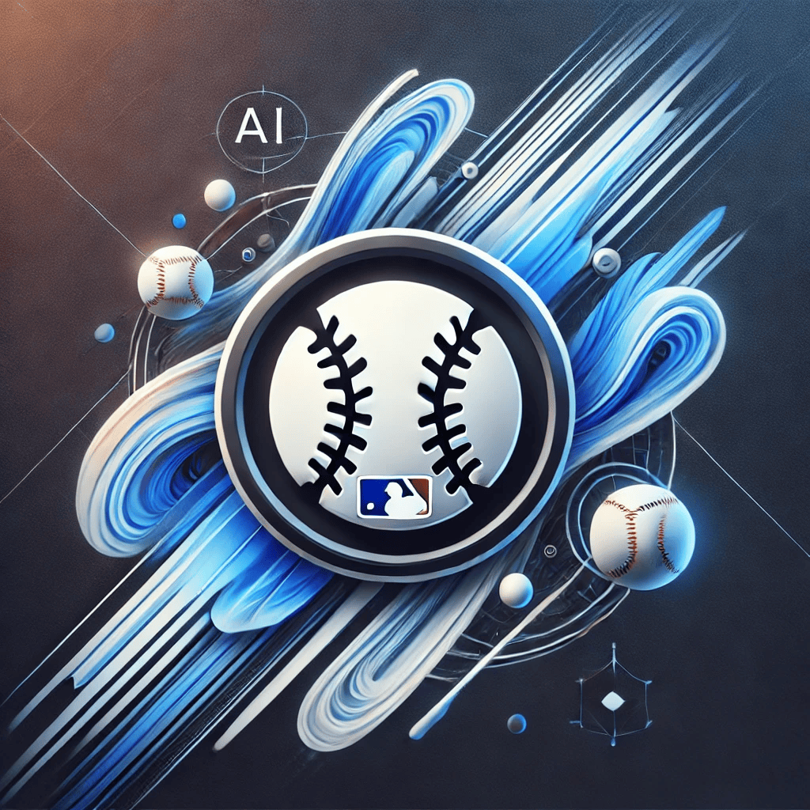
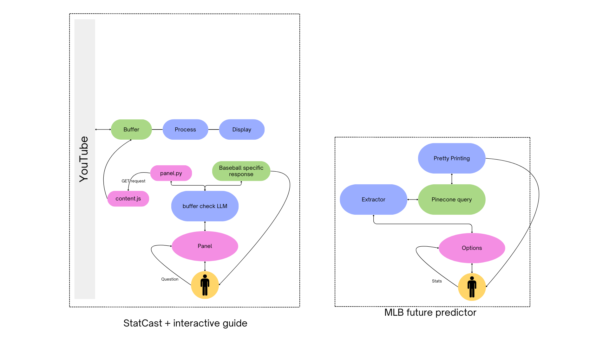
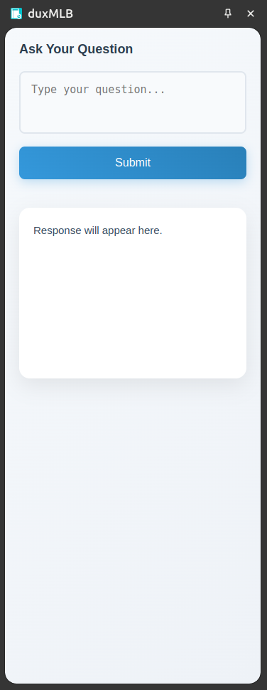
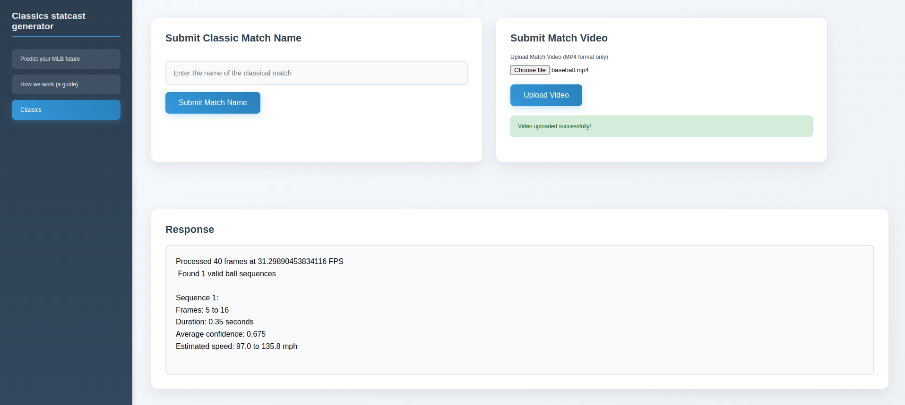
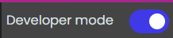
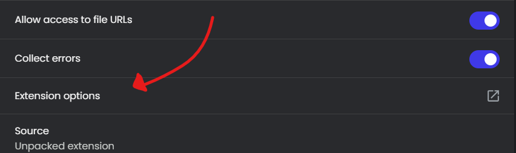

# duxMLB - an extension

  
  

---

We're gonna work under the assumption that the laptop is not strong enough to run the models fast enough.

# Work

Options page

- [ ] Make it look better (add the similarity table in the right div)
- [ ] In the second edition I am planning on annotating the video feed itself and displaying the entire video as an output. This will be much easier for the user to comprehend!
- [ ] Figure out the sending and recieving of the buffer video
- [ ] The novice users can enter a `mp4` video file that contains them practising their swings or pitches.
- [x] See if we can incorporate the curve of the ball during the pitch... (this we did using parabolic trajectory calculations)
- [ ] Write the readme for the math and the implementation of speed calculation precisely! Explain the use of scale factor precisely
- [ ] Create a schedule parser
- [ ] We'll probably have to switch from yolo to EfficientDet cause yolo is not google's.

How do we compare swings? Will have to learn...

# More things

- [ ] Integrating velocity finder with panel.py
- [ ] Creating a exit-velocity finder using bat-tracking
- [ ] Update logic to handle different camera angles. (to some extent, the math works --> Incorporating the scale factor)
- [x] Run statcast on the downloaded youtube video (at least the speed calculation works!)

Developing an extension that can read your screen and give you live data updates and tips on your favourite baseball games! (With permission)

> [!IMPORTANT]
> What can you do with duxMLB?

**duxMLB** offers two features
1. Panel page: For when you are watching a YouTube match. (can be later extended to others as well)
2. Options page: For predicting your MLB future by comparing you to top players!

There is also a `guide` page which explains how the site was made and contains all the techincal explanations. Visit this in the `extension options` and figure out what's in store for you!

## What is the panel page?

The panel page contains a `gemini` model that allows you to do the following

- [x] Ask the model about any players, team or MLB schedule and it will give `upto date` information (regards to APIs provided by Google)
- [ ] You can, while watching a LIVE match, ask the model statcast data and it will analyize and answer!

> [!NOTE]
> What does that mean?

You can ask it questions like "Yoo! How fast was that pitch?" as soon as the pitcher finished pitching, and we will process the video in the backend, analyse the speed and tell it to you!

`duxMLB` is the most complete MLB guide that exists today.

---

# The workflow

# The looks

This is the side panel. You can open this in any youtube video (currently works only for youtube).

---

This is the options page. This page is to help you predict your MLB future and a how to guide on the **technical implementations** of the extension. It involves the entire pipeline!

---

Have created seperate ports for the panel and the options page because it will be much easier to manage and make changes in that.

---

# Installing

I don't have a CWS developer account (cause I don't have 5 dollars), and hence I couldn't publish this on the webstore. So, I'll give the instructions to run this extension locally on your machine.

1. Clone the repository using

       git clone https://github.com/pUrGe12/MLBxG-extension

2. Now open chrome extensions using

       chrome://extensions

3. Toggle the `developer mode` button (on the top right) and then click on `load unpacked`

   

5. Select the `src` directory (inside the folder you cloned from github).

6. Click on `details` and visit the `options` page. This has more functionalities that cater to the other problems mentioned in the problem statment (and some fun stuff too).
    
   

8. Now you're good to go!

---

# Training a custom YOLOv5 model

These are the steps you need to follow to train your YOLOv5s model.

Clone the YOLOv5 repository

        git clone https://github.com/ultralytics/yolov5.git
        cd yolov5

Install the dependencies

        pip install -r requirements.txt

Head over to a [roboflow dataset](https://universe.roboflow.com/yolotest1/yolov5test2). Download the dataset in the `YOLO v5 PyTorch` format. You might get a download link as below. 

Execute the script where you want to save your dataset. Mostly do this inside the `yolov5` directory itself (that we cloned above)

        curl -L "https://universe.roboflow.com/ds/lPAYhwr8hN?key=o2ef7xqXid" > roboflow.zip; unzip roboflow.zip; rm roboflow.zip

Ensure that it has a `train` and `test` directories with **images** and **labels** inside them.

Then edit the `data.yaml` file and update the paths to the training and testing datasets

> [!NOTE]
> You can remove the `val` header in there. Also, if the dataset contains more than 1 objects that it can detect, then insure that you're filtering for baseballs only.

Example `data.yaml`

        train: ../train/images
        val: ../valid/images
        test: ../test/images

        nc: 3
        names: ['ball', 'bat', 'glove']

        roboflow:
          workspace: yolotest1
          project: yolov5test2
          version: 1
          license: CC BY 4.0
          url: https://universe.roboflow.com/yolotest1/yolov5test2/dataset/1

---

Now, comes the crucial part. Read the `README.roboflow.txt` it will look something like this

        yolov5test2 - v1 2024-03-13 9:56am
        ==============================

        This dataset was exported via roboflow.com on March 13, 2024 at 1:57 AM GMT

        Roboflow is an end-to-end computer vision platform that helps you
        * collaborate with your team on computer vision projects
        * collect & organize images
        * understand and search unstructured image data
        * annotate, and create datasets
        * export, train, and deploy computer vision models
        * use active learning to improve your dataset over time

        For state of the art Computer Vision training notebooks you can use with this dataset,
        visit https://github.com/roboflow/notebooks

        To find over 100k other datasets and pre-trained models, visit https://universe.roboflow.com

        The dataset includes 895 images.
        Baseball are annotated in YOLO v5 PyTorch format.

        The following pre-processing was applied to each image:
        * Auto-orientation of pixel data (with EXIF-orientation stripping)
        * Resize to 640x640 (Stretch)

        The following augmentation was applied to create 3 versions of each source image:
        * 50% probability of horizontal flip
        * Equal probability of one of the following 90-degree rotations: none, clockwise, counter-clockwise

This is important because 

1. We want to enter the image size when we are training it (in this case 640x640 pixels). 
2. We want to create the exact same situation when we are testing it in our use case (that is, before running this model, we'll edit the image similarly and resize it)

---

Inside the `yolov5` directory then run the following code

        python3 train.py --img 640 --batch 16 --epochs 50 --data ./data.yaml --weights yolov5s.pt --name baseball_detection

This will start training the model. The new weights will be saved in `runs/train/baseball_detection/weights/best.pt`

So, in order to use the model, we'll have to use the `best.pt` weights. Refer to the using codes for that. 