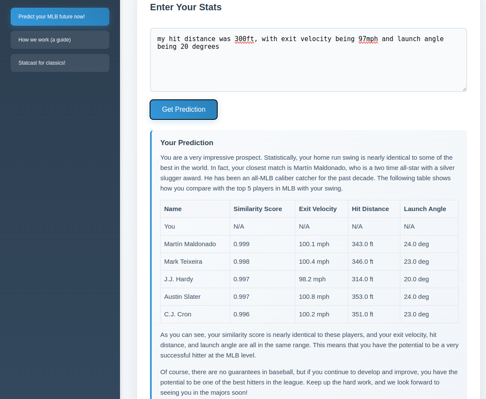

# MLBxG-extension

  
  

Developing an extension that can read your screen and give you live data updates and tips on your favourite baseball games! (With permission)

## The workflow

## The looks

This is the side panel. You can open this in any youtube video (currently works only for youtube).

---

This is the options page. This page is to help you predict your MLB future and a how to guide on the **technical implementations** of the extension. It involves the entire pipeline!

## Work

- [x] Finish the pinecone pipeline and prediction model
- [ ] Make it look better (add the similarity table in the right div)

---

- [ ] Figure out the sending and processing of buffer
- [ ] Train and test YOLOv5 on baseball detection in images
- [ ] Test if the pipeline works 
- [ ] Integrate the metric finding with panel.py

Have created seperate ports for the panel and the options page because it will be much easier to manage and make changes in that.

# Installing
