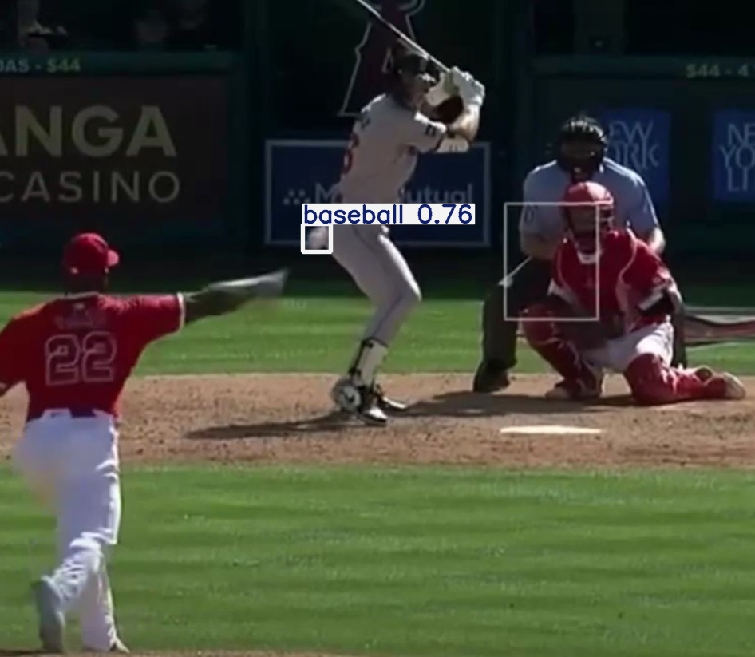

# Using the pre-trained model on MLB data

Found the cool github repo linked previously. Here I'll test that out and see if the models are any good. 

I have directly used the weights given by them.

## It works!

This is running a single image detection using that model

## Tracking idea

We can split the image into different frames and then apply this model to each frame, get the coordinates of the ball. 

Now we need to be smart here

Sometimes the balls coordinates will be completely wrong (because the detection model will detect something else as the ball too, it happens)
So, we also need to check if the coordinates of the ball in the current frame are radically different from those in the previous frame, then it means that the detection model has identified something else as the ball and hence, we must neglect that frame's data.
Then once we neglect that frames data (this means, we don't add those coordinates in our list), we go to the next frame and again check the coords with the last ones present in our list (that is the one before the neglected frame)

Also, we will only calculate the speed when we find the ball in at least 10 consecutive frames.

This is because the video feed I'll be using is around a 5 second long. The ball moves with the pitcher's hand too and is sometimes picked up. This might go into our coordinates list!

So, in that list, we also need to maintain a frame count, and a live time count. That is, assuming 30fps, if I have 4 seconds of data it becomes 120 frames in total. Now assuming in we get the baseball detections in frames 2, 4, 10, 20, then 30 to 60 continously and then 65 and fianlly 118, this means the ball was continously travelling for the frames 30 to 60. 

This means 30 frames which imples 1 second (cause 30 frames per second). Hence the ball travelled for 1 second and the pitch length is say 60 feet += 10 feet (we'll give a tolerance because the baseball might stop being detected when close to the batter due to same color) then we get an estimate for speed as being in between 70 ft/s to 50 ft/s.

---

Added logic:

Say there are 10 frames and the detections are as follows
1 not detected
2 not detected
3 not detected
4 detected
5 detected 
6 detected
7 not detected 
8 detected 
9 not detected 
10 not detected

as we can see in it is likely that the ball was travelling continously during this motion as we got a string of detected messages, but it was interuptted by the 7th frame.

What I want is if we ever encounter a situation such as 

detected
not detected 
detected

Then I want to take the frame that was not detected (say x) and consider the ball's cooridinates in that frame to be the average of x-1 and x+1st frames. 

Thus,

- If there is a baseball being detected in frame x, then not in x+1, then again in x+2, then we can consider the position of the ball in the x+1th frame 
as the average of the two

- This means we can add that in our valid sequence! (thus getting longer and more accurate results.)

This we'll do using interpolated fields.

---

## Note

If you want to use the v4 model, the weights are in the desktop (cound't push that in github cause it was too big! Will prolly compress and use.)